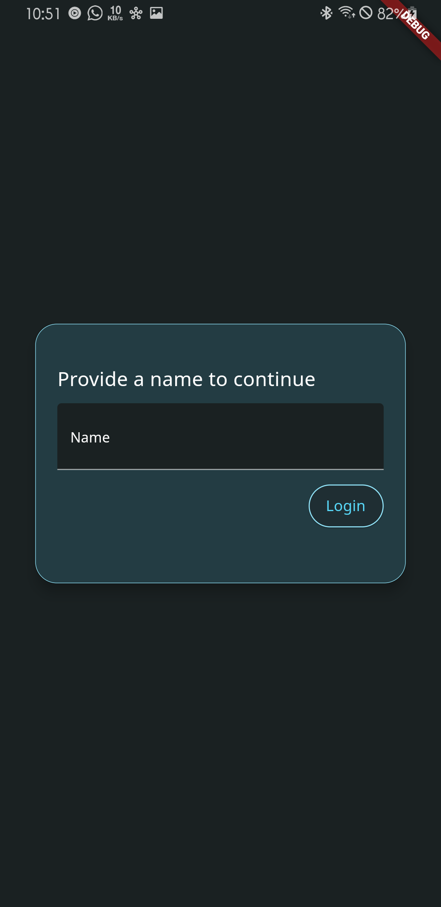
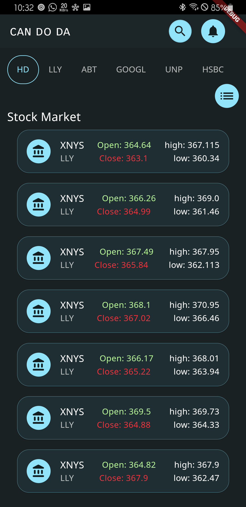
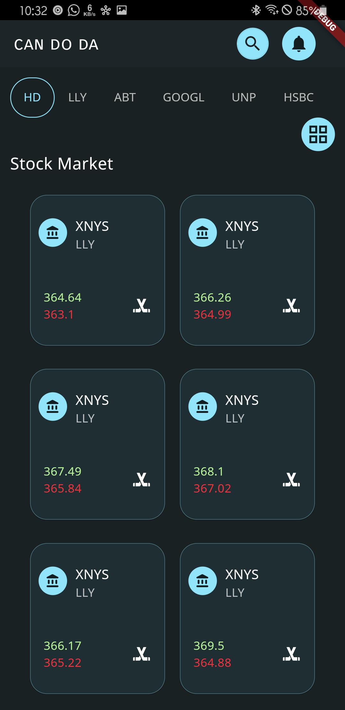
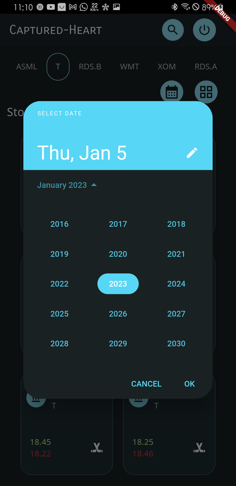
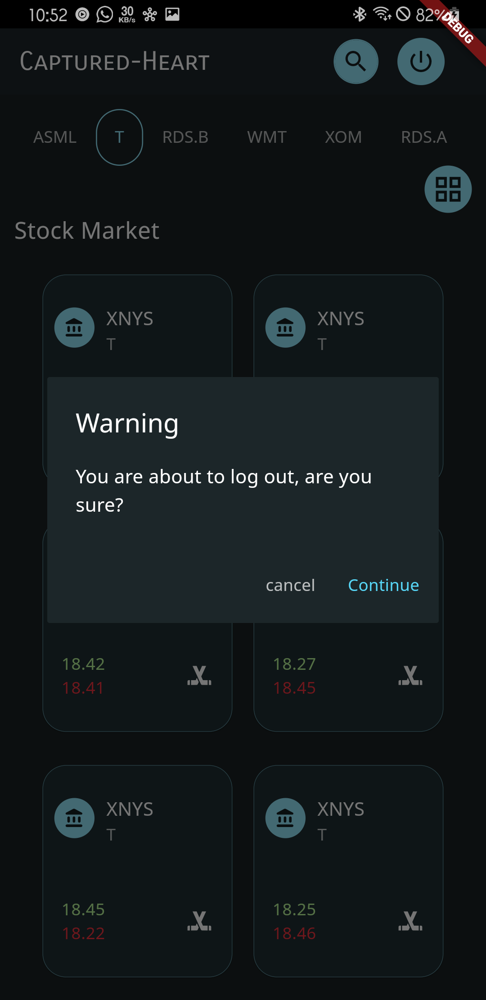
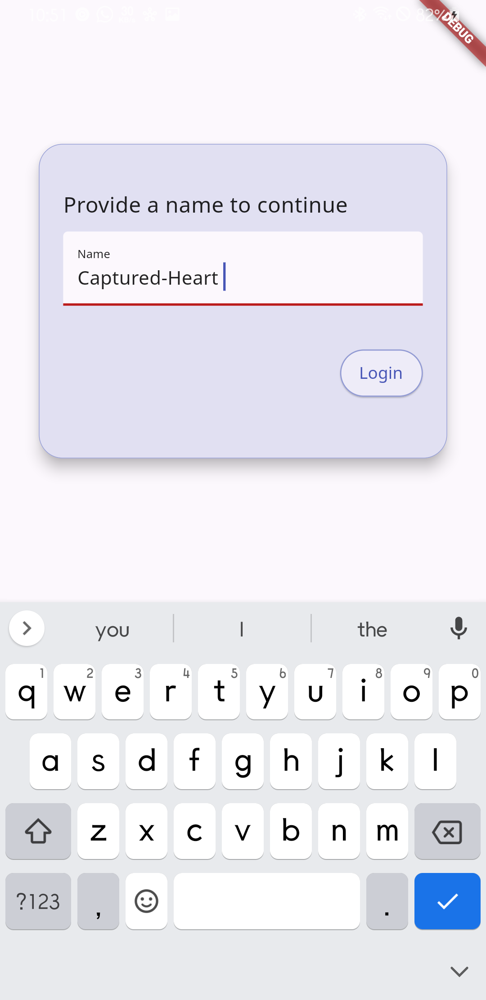
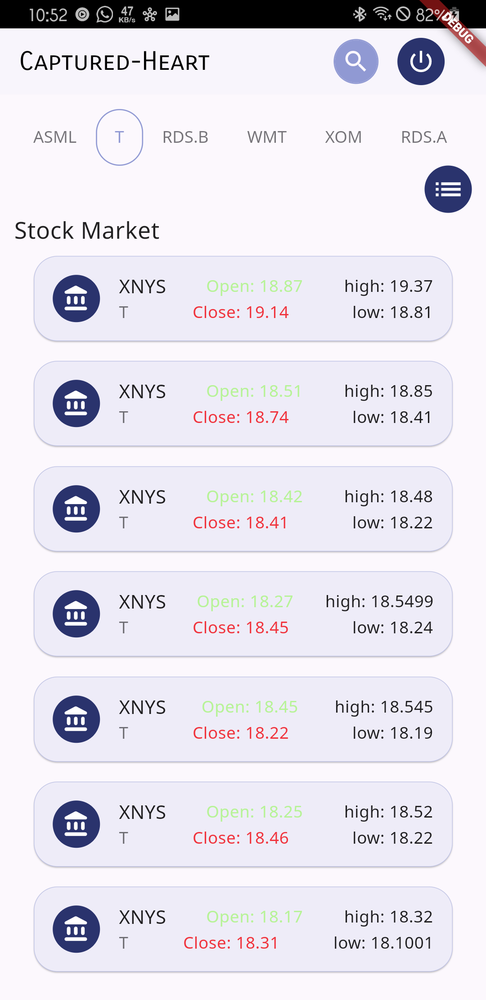
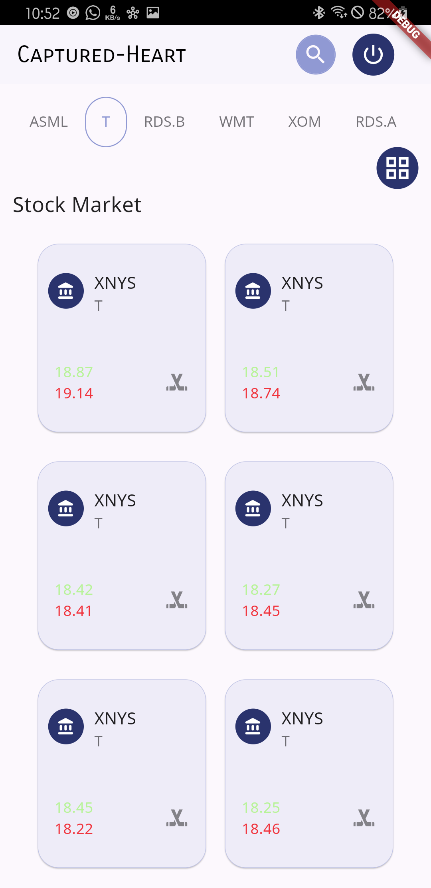
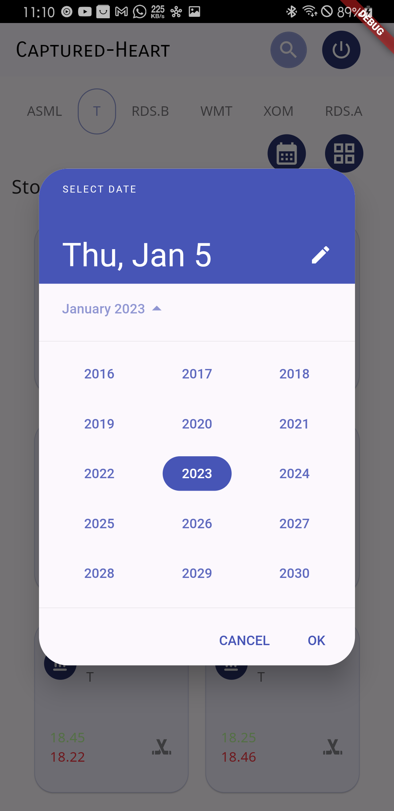
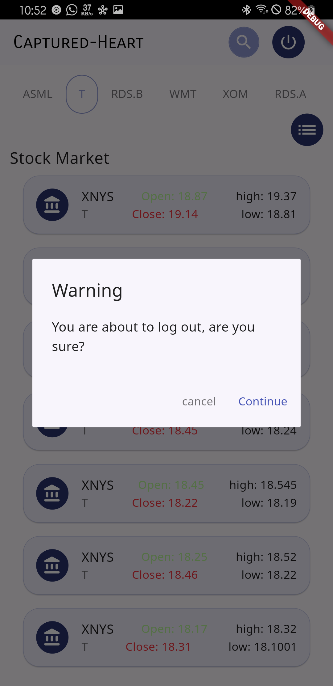

   
   
  <h1>QwikCountr Demo</h1>
  <strong>A Flutter app that displays stock market data and allows users to track their favorite stocks.</strong>
   

Built by <a href="https://twitter.com/CapturedWarrior">Captured-Heart</a>
 

<i><h3 style="color: green">You can download the apk directly from my firebase distribution console <a href="https://appdistribution.firebase.dev/i/e5a7b73fefe2dd61">QwikCountr-Demo</a></h3></i>

# Features

- Real-time stock data for major stock exchanges
- Add stocks to a watchlist and track their performance(Gridview and ListView)
- Dark and light themes for a personalized look
- Offline support for viewing stock data when an internet connection is not available

## UI Shots

  <table>
    <tr>
      <td style="text-align: center">
        
      </td>
      <td style="text-align: center">
        
      </td>
      <td style="text-align: center">
        
      </td>
      <td style="text-align: center">
        
      </td>
      <td style="text-align: center">
        
      </td>
    </tr>
    <tr>
      <td style="text-align: center">
        
      </td>
      <td style="text-align: center">
        
      </td>
      <td style="text-align: center">
        
      </td>
      <td style="text-align: center">
        
      </td>
      <td style="text-align: center">
        
      </td>
    </tr> 
  </table>

## Tools

- [flex_color_scheme: by my friend SuperMike](https://pub.dev/packages/flex_color_scheme) visit his website: [rydMike.com](rydmike.com)
- [flutter_native_splash](https://pub.dev/packages/flutter_native_splash)
- [shared_preferences](https://pub.dev/packages/shared_preferences)
- [internet_connection_checker: This was really helpful in checking for failed internet connection](https://pub.dev/packages/internet_connection_checker)
- [flutter_riverpod: A very great tool for managing states acroos any application by Remi Rousselette ](https://pub.dev/packages/flutter_riverpod)

For a full description of OSS used, see pubspec.yaml

# Credits

Stock data provided, and you can also generate your own Api keys on [MarketstackAPI](https://marketstack.com/)
